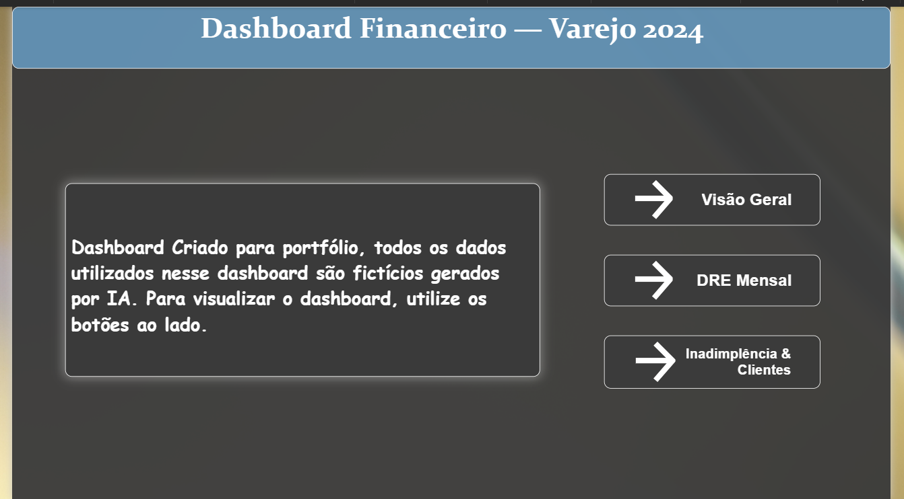
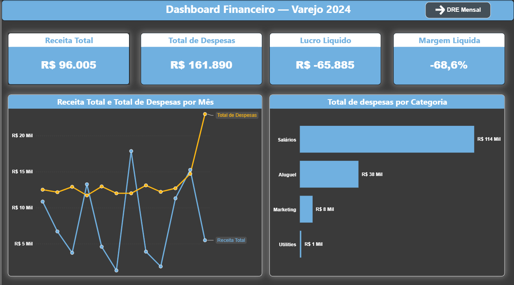
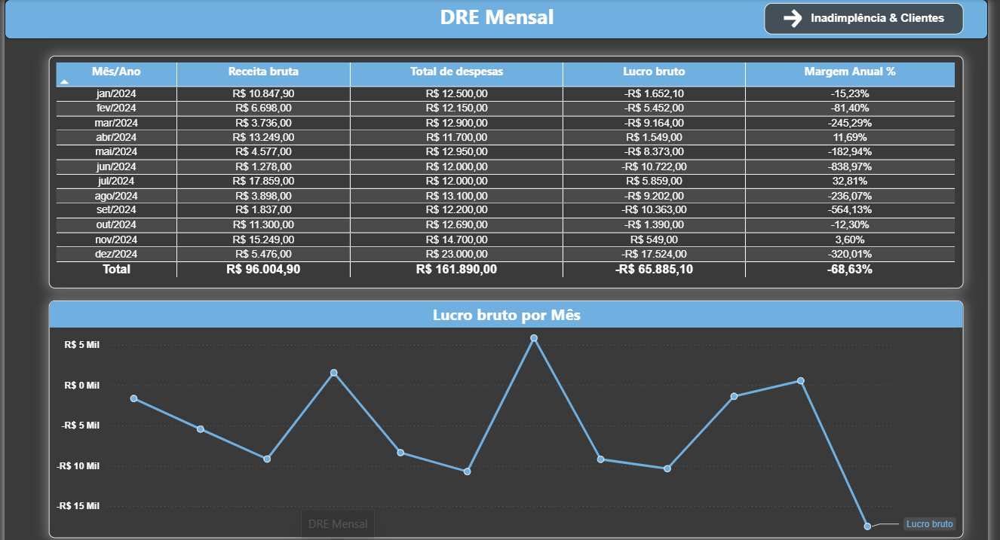
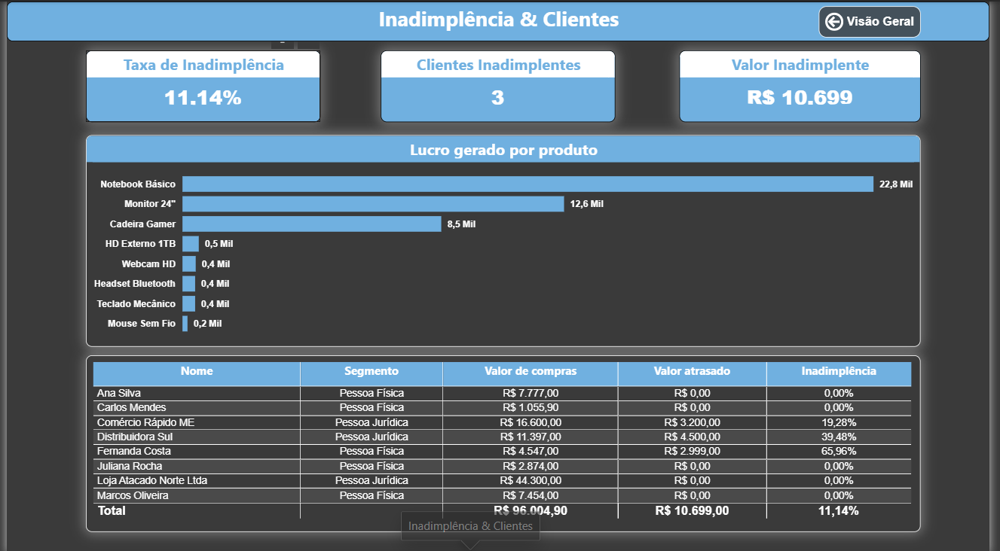

# 📊 Dashboard Financeiro — Varejo 2024

Dashboard de análise financeira desenvolvida com **MySQL** e **Power BI**, simulando o ambiente de dados de uma empresa de varejo.

---

## 🎯 Objetivo do Projeto

Demonstrar a integração entre banco de dados relacional e ferramenta de BI, construindo um pipeline completo de dados:

**MySQL → Queries SQL → Power BI → Dashboard Gerencial**

---

## 🖥️ Páginas do Dashboard

### Apresentação


Breve apresentação do dashboard.

### Visão Geral


Indicadores principais da operação:
- **Receita Total:** R$ 96.005
- **Total de Despesas:** R$ 161.890
- **Lucro Líquido:** R$ -65.885
- **Margem Líquida:** -68,6%

### DRE Mensal


Demonstração do Resultado do Exercício mês a mês, com evolução do lucro bruto ao longo do ano.

### Inadimplência & Clientes


Análise de risco da carteira de clientes:
- **Taxa de Inadimplência:** 11,14%
- **Clientes em Atraso:** 3
- **Valor Inadimplente:** R$ 10.699

---

## 🗄️ Estrutura do Banco de Dados

```sql
financeiro_varejo/
├── clientes    -- Cadastro de clientes PF e PJ
├── produtos    -- Catálogo com custo e preço de venda
├── vendas      -- Histórico de vendas com status de pagamento
├── itens_venda -- Itens de cada venda (relacionamento N:N)
└── despesas    -- Despesas operacionais por categoria
```

---

## 📁 Arquivos SQL

| Arquivo | Descrição |
|---------|-----------|
| `sql/criar_banco.sql` | Criando o banco |
| `sql/popular_dados.sql` | Dados fictícios para simulação |
| `sql/queries_analises.sql` | Queries de análise usadas no Power BI |

---

## 🛠️ Tecnologias utilizadas

- **MariaDB 10.4** (via XAMPP) - banco de dados relacional
- **Power BI Desktop** - modelagem e visualização
- **DAX** - linguagem de medidas do Power BI
- **ODBC Connector** - integração MariaDB ↔ Power BI

---

## 📌 Principais aprendizados

- Modelagem de dados com tabela fato e dimensão
- Criação de medidas DAX para KPIs financeiros
- Integração de banco de dados local com Power BI via ODBC
- Análise de DRE, inadimplência e margem lucro